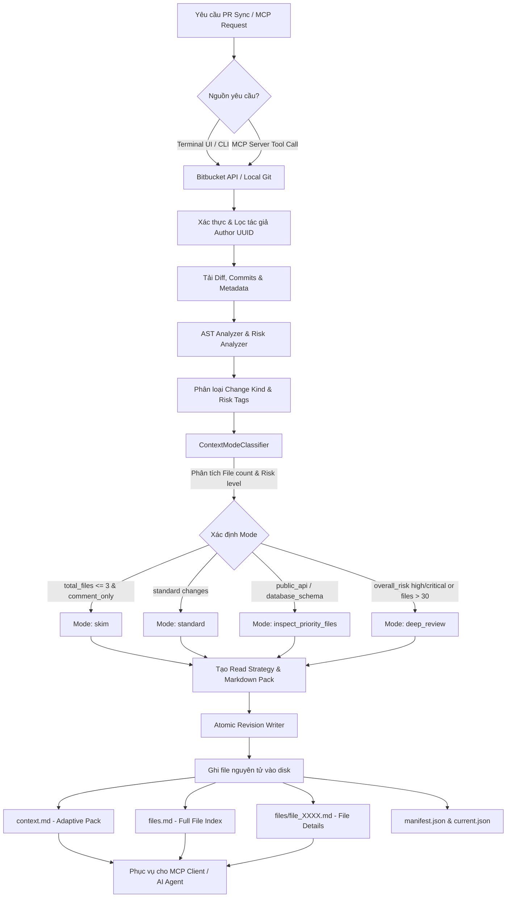

# 🚀 mcp-pr-companion

`mcp-pr-companion` là hệ thống pre-process Git Pull Request (Bitbucket Cloud REST API v2 & local Git) thành **Adaptive AI Context Packs** nhỏ gọn, tối ưu token mạnh mẽ cho AI Coding Assistants và AI Agents.

---

## 📌 1. Mô Tả Các Tính Năng Hiện Có (Features Overview)

* **Adaptive AI Context Strategy (Phân loại Context thích ứng)**:
  - Tùy chỉnh context pack theo độ phức tạp và rủi ro của PR với 4 chế độ: `skim`, `standard`, `inspect_priority_files`, và `deep_review`.
  - Tự động sinh **Read Strategy** định hướng AI những file bắt buộc đọc, file tùy chọn và những phần nên bỏ qua để tiết kiệm token tối đa (giảm từ 70% - 95% token tiêu thụ).
  - Tách danh sách file đầy đủ sang `files.md`, giữ `context.md` cực gọn (chỉ 0.5 - 1KB đối với PR comment-only).
* **Schema v4 & Atomic Revision Storage**:
  - Lưu trữ đa phiên bản (multi-revision) theo mô hình lưu nguyên tử (atomic write staging) đảm bảo tính toàn vẹn dữ liệu.
  - Quản lý con trỏ phiên bản active thông qua `current.json` (`context_path`, `files_summary_path`, `actions_path`, `manifest_path`).
* **MCP Server & Dual-Interface**:
  - **Local MCP Server over stdio**: Cung cấp các MCP tools (`get_pr_context_pack`, `get_pr_file_context`, `search_pr_files`, `get_pr_manifest`, `get_pr_sync_status`, `refresh_pr_data`) để kết nối trực tiếp với AI IDE/Agents.
  - **Terminal UI (`npm run cmd`)**: Giao diện dòng lệnh tương tác giúp cấu hình token, quản lý PR registry, đồng bộ dữ liệu và xem log.
  - **One-Command Auto Sync (`npm run mcp-pr-companion`)**: Tự động phát hiện (discover), lọc và tạo context pack cho toàn bộ PR OPEN của user chỉ trong 1 câu lệnh.
* **AST Analyzer & Secret Redacting Security**:
  - Phân loại loại thay đổi (`comment_only`, `functional_logic`, `public_api`, `database_schema`, `auth_security`, `configuration`, v.v.).
  - Trích xuất ký hiệu mã nguồn (functions, methods, HTTP routes).
  - Tự động quét và che giấu bí mật (tokens/passwords) bằng module `Redactor` (`ATBB****abcd`).
  - Khóa danh tính tác giả (`author.uuid`) tránh rò rỉ PR giữa các tài khoản.

---

## 🛠️ 2. Danh Sách Các Lệnh Hiện Có (Available Commands)

| Lệnh (Command) | Mô tả chi tiết |
|---|---|
| `npm run cmd` | Khởi chạy **Terminal UI (TUI)** tương tác để cấu hình API token, quản lý registry danh sách PR, đồng bộ dữ liệu và kiểm tra logs. |
| `npm run cmd:prod` | Khởi chạy Terminal UI bằng mã đã được build trong thư mục `dist/`. |
| `npm run mcp-pr-companion` | Chạy lệnh **One-Command Auto Runner**: Tự động xác thực session, quét tất cả PR OPEN của tác giả hiện tại và đồng bộ/tạo context pack tự động. |
| `npm run mcp-pr-companion:prod` | Chạy One-Command Auto Runner bằng mã đã được build trong thư mục `dist/`. |
| `npm start` | Khởi chạy **Local MCP Server** ở chế độ production qua stdio transport để AI Agents kết nối. |
| `npm run dev` | Khởi chạy MCP Server ở chế độ development với hot-reloading (`tsx`). |
| `npm run build` | Biên dịch mã nguồn TypeScript (`src/`) sang JavaScript (`dist/`). |
| `npm test` | Chạy toàn bộ **Test Suite tự động** (Unit tests, Schema Contract validation, Referential Integrity, Aggregate validation, 9 Golden Scenarios, Atomic Write Rollback và Orchestration tests). |
| `npm run setup` | Khởi tạo môi trường ban đầu, tạo các thư mục cấu hình và cài đặt mặc định. |
| `npm run check-deps` | Kiểm tra tính sẵn sàng của các package phụ thuộc trong dự án. |
| `npm run install-deps` | Kiểm tra và tự động cài đặt các dependencies còn thiếu. |
| `npm run healthcheck` | Chạy kiểm tra sức khỏe hệ thống (Node.js version, Git CLI availability). |
| `npm run generate` | Chạy CLI runner phát sinh PR payload đơn lẻ. |

---

## 🔄 3. Workflow Tổng Quan (Feature Workflow)

Sơ đồ thể hiện luồng xử lý từ khi nhận yêu cầu PR cho đến khi sinh ra **Adaptive AI Context Pack** và phục vụ cho MCP Client/AI Agent:



---

## 📁 Thư Mục Lưu Trữ Context Output

Dữ liệu context pack sau khi sinh ra được lưu theo cấu trúc:
```text
ai-context/{company}/{app}/{feature}/{repo}_{PR-ID}/
├── context.md          # AI entrypoint (Adaptive Markdown context)
├── files.md            # Bảng tổng hợp đầy đủ danh sách file thay đổi
├── actions.md          # Tóm tắt lịch sử tool & độ bao phủ coverage
├── current.json        # Pointer chứa thông tin revision active & mode
├── manifest.json       # Metadata tổng hợp (v4 Schema)
├── files/              # Chi tiết từng file theo yêu cầu
│   ├── file_0001.md
│   └── file_0002.md
└── revisions/          # Lưu trữ lịch sử các revision
    └── rev_xxxx_yyyy/
```
