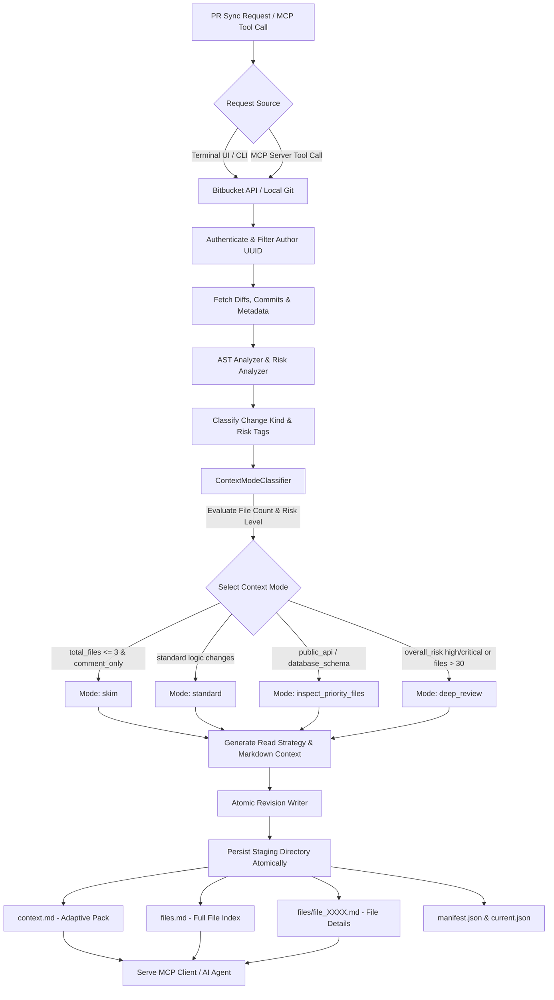

# 🚀 mcp-pr-companion

`mcp-pr-companion` is a dual-interface local pre-processing system (supporting Bitbucket Cloud REST API v2 & local Git diffs) designed to convert Pull Requests into compact, **Adaptive AI Context Packs** optimized for AI Coding Assistants and AI Agents.

---

## 📌 1. Features Overview

* **Adaptive AI Context Strategy**:
  - Dynamically tailors context pack structures based on PR size and risk level across 4 modes: `skim`, `standard`, `inspect_priority_files`, and `deep_review`.
  - Automatically generates an explicit **Read Strategy** section guiding AI agents on required next files, optional next files, and skipped categories to optimize token efficiency (**70% - 95% token savings**).
  - Moves full file lists into `files.md`, keeping `context.md` ultra-compact (0.5 – 1KB for comment-only PRs).
* **Schema v4 & Atomic Revision Storage**:
  - Multi-revision storage engine featuring atomic write staging to prevent partial writes.
  - Manages active revision pointers via `current.json` (`context_path`, `files_summary_path`, `actions_path`, `manifest_path`, `ai_reading_mode`).
* **MCP Server & Dual-Interface Architecture**:
  - **Local MCP Server over stdio**: Exposes MCP tools (`get_pr_context_pack`, `get_pr_file_context`, `search_pr_files`, `get_pr_manifest`, `get_pr_sync_status`, `refresh_pr_data`) for direct integration with AI IDEs and Agents.
  - **Terminal UI (`npm run cmd`)**: Interactive TUI for token configuration, PR link registry management, cache warming, and log inspection.
  - **One-Command Auto Sync (`npm run mcp-pr-companion`)**: Automated sequential discovery, filtering, and context pack generation for all OPEN pull requests owned by the user.
* **AST Analyzer & Secret Redacting Security**:
  - Classifies change kinds (`comment_only`, `functional_logic`, `public_api`, `database_schema`, `auth_security`, `configuration`, etc.).
  - Extracts source code AST symbols (functions, methods, HTTP routes).
  - Automatically scans and redacts tokens/passwords via `Redactor` (`ATBB****abcd`).
  - Enforces account identity locking (`author.uuid`) to prevent cross-account PR data leakage.

---

## 🛠️ 2. Available Commands

| Command | Description |
|---|---|
| `npm run cmd` | Launches the interactive **Terminal UI (TUI)** to configure API tokens, manage PR link registry, warm local cache, and inspect sync logs. |
| `npm run cmd:prod` | Launches the Terminal UI using compiled JavaScript assets in `dist/`. |
| `npm run mcp-pr-companion` | Runs the **One-Command Auto Runner**: Authenticates session, discovers all OPEN pull requests for the active user, and syncs/generates context packs automatically. |
| `npm run mcp-pr-companion:prod` | Runs the One-Command Auto Runner using compiled JavaScript assets in `dist/`. |
| `npm start` | Starts the **Local MCP Server** in production mode over stdio transport for AI Agent connections. |
| `npm run dev` | Starts the MCP Server in development mode with `tsx` hot reloading. |
| `npm run build` | Compiles TypeScript source files (`src/`) into JavaScript (`dist/`). |
| `npm test` | Runs the complete **Automated Test Suite** (Unit tests, Schema Contract validation, Referential Integrity, Aggregate validation, 9 Golden Scenarios, Atomic Write Rollback, and Orchestration tests). |
| `npm run setup` | Initializes local environment, directory structures, and default configuration templates. |
| `npm run check-deps` | Verifies required Node.js package dependencies. |
| `npm run install-deps` | Automatically installs missing Node.js dependencies. |
| `npm run healthcheck` | Performs pre-flight environment checks (Node.js version, Git CLI availability). |
| `npm run generate` | CLI runner for generating single PR payloads. |

---

## 🔄 3. Feature Workflow

The diagram below illustrates the end-to-end pipeline from PR request to **Adaptive AI Context Pack** generation and MCP serving:



---

## 📁 Runtime Directory & Context Output Layout

Generated context packs are structured as follows:

```text
ai-context/{company}/{app}/{feature}/{repo}_{PR-ID}/
├── context.md          # Primary AI Entrypoint (Adaptive Markdown Context Pack)
├── files.md            # Complete Changed Files Index & Categorization Table
├── actions.md          # Tool Action Summary & Coverage Metadata
├── current.json        # Pointer to Active Revision & Reading Mode
├── manifest.json       # Structured Metadata Manifest (v4 Schema)
├── files/              # Per-file AI Detail Markdown Files
│   ├── file_0001.md
│   └── file_0002.md
└── revisions/          # Revision History Subdirectory
    └── rev_xxxx_yyyy/
```
